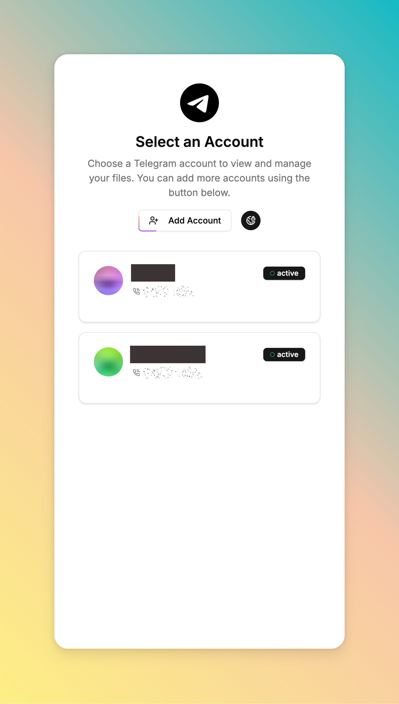
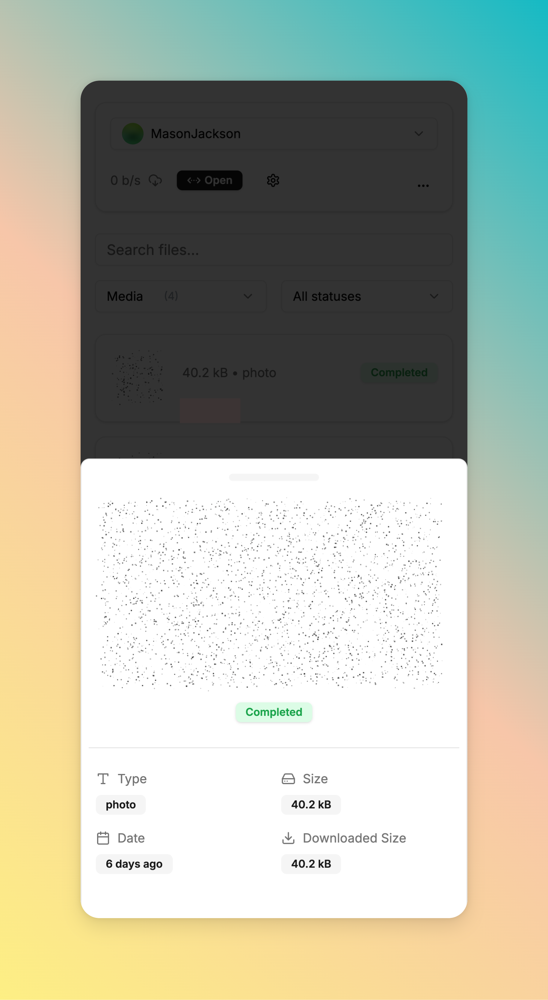
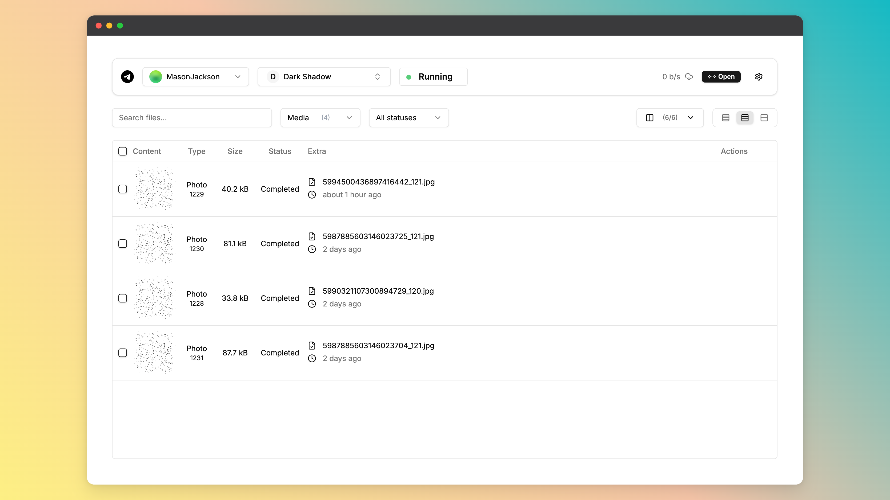
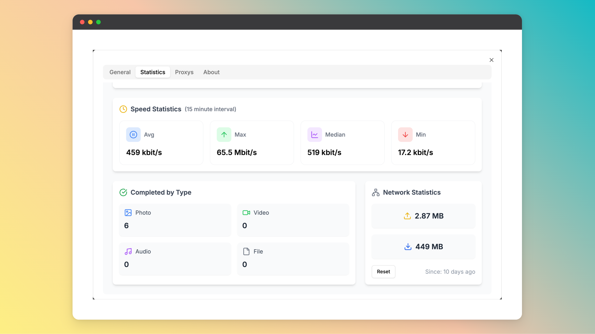

<p align="center">
    
</p>
<p align="center"><h1 align="center">Telegram Files</h1></p>
<p align="center">
	<em><code>A self-hosted Telegram file downloader for continuous, stable, and unattended downloads.</code></em>
</p>
<p align="center">
    🚀 <strong>中文界面支持</strong> | 🔧 <strong>优化分组功能</strong> | 🐳 <strong>多平台镜像</strong>
</p>
<p align="center">
	
	
	
    <a href="https://codecov.io/gh/jarvis2f/telegram-files" >
        
    </a>
</p>
<br>

## ✨ 优化版本特性

本版本基于原版 telegram-files 进行以下优化：

### 🇨🇳 中文界面支持
- ✅ 完整的简体中文界面翻译
- ✅ 所有按钮、提示信息、错误消息均已汉化
- ✅ 更好的中文用户体验

### 📁 优化的文件分组功能
- ✅ **GROUP_BY_CHAT 策略优化**：使用频道/群组名称代替数字 ID
- ✅ 更直观的文件夹结构
- ✅ 文件管理更清晰

### 🐳 多平台 Docker 镜像
- ✅ 支持 `linux/amd64` (x86_64)
- ✅ 支持 `linux/arm64` (ARM64)
- ✅ 适用于各种服务器环境

### 🔧 改进的文件路径处理
- ✅ 自动清理文件名中的非法字符
- ✅ 避免特殊符号导致的文件创建失败
- ✅ 更好的跨平台兼容性

---

## 🔗 目录

- [📍 简介](#-简介)
- [🧩 截图](#-截图)
- [🚀 快速开始](#-快速开始)
- [⌨️ 开发](#️-开发)
    - [☑️ 环境要求](#-环境要求)
    - [⚙️ 安装](#-安装)
- [📌 项目路线图](#-项目路线图)
- [🔰 贡献](#-贡献)
- [🎗 许可证](#-许可证)
- [🆗 常见问题](#-常见问题)

---

## 📍 简介

Telegram Files 是一个自托管的 Telegram 文件下载器，支持：

- ✅ 从 Telegram 频道和群组无缝下载文件
- ✅ 支持多个 Telegram 账户同时管理和下载文件
- ✅ 随时暂停和恢复下载，自动转移文件到指定目录
- ✅ 即时预览下载的视频和图片
- ✅ 完全响应式设计，支持移动端访问、PWA 和离线功能
- ✅ 轻松从 Telegram 分享链接获取文件
- ✅ **中文界面** - 原生简体中文支持
- ✅ **优化的文件分组** - 使用名称而非 ID

---

## 🧩 截图

<div align="center">
    
    
</div>

<details closed>
<summary>更多截图</summary>
<div align="center">
    
    
</div>

<div align="center">
    
    
</div>
</details>

## 🚀 快速开始

在使用 telegram-files 之前，你需要申请 Telegram API ID 和 Hash。请访问 [Telegram API](https://my.telegram.org/apps) 页面申请。

**使用 Docker**

```shell
docker run -d \
  --name telegram-files \
  --restart always \
  -e APP_ENV=${APP_ENV:-prod} \
  -e APP_ROOT=${APP_ROOT:-/app/data} \
  -e TELEGRAM_API_ID=${TELEGRAM_API_ID} \
  -e TELEGRAM_API_HASH=${TELEGRAM_API_HASH} \
  -p 6543:80 \
  -v ./data:/app/data \
  rboyy/telegram-files:latest  # 使用优化版本
```

**使用 docker-compose**

复制 [docker-compose.yaml](docker-compose.yaml) 和 [.env.example](.env.example) 到你的项目目录，运行：

```sh
docker-compose up -d
```

**在 unRaid 上安装**

在 unRaid 上，可以通过社区仓库搜索 `telegram-files` 进行安装。

> **重要提示**：请不要将服务暴露到公共互联网。因为该服务不是为公共访问设计的。

---

## ⌨️ 开发

### ☑️ 环境要求

在开始使用 telegram-files 之前，请确保你的运行环境满足以下要求：

- **编程语言：** JDK23, TypeScript
- **包管理器：** Gradle, Npm
- **容器运行时：** Docker

### ⚙️ 安装

使用以下方法之一安装 telegram-files：

**从源码构建：**

1. 克隆 telegram-files 仓库：

```sh
git clone https://github.com/rboyy/telegram-files
```

2. 进入项目目录：

```sh
cd telegram-files
```

3. 安装项目依赖：

**使用 npm**

```sh
cd web
npm install
```

**使用 gradle**

```sh
cd api
gradle build
```

**使用 docker**

```sh
docker build -t rboyy/telegram-files .
```

## 📌 项目路线图

- ✅ **`任务 1`**：根据设置规则自动下载文件
- ✅ **`任务 2`**：下载统计和报告
- ✅ **`任务 3`**：改进 Telegram 登录功能
- ✅ **`任务 4`**：支持自动转移文件到其他目录
- ✅ **`任务 5`**：使用虚拟列表优化文件表格
- ✅ **`任务 6`**：预加载文件信息以支持搜索
- ✅ **`任务 7`**：中文界面支持
- ✅ **`任务 8`**：优化的文件分组策略

---

## 🔰 贡献

- **💬 [参与讨论](https://github.com/rboyy/telegram-files/discussions)**：分享你的见解，提供反馈或提出问题
- **🐛 [报告问题](https://github.com/rboyy/telegram-files/issues)**：提交发现的错误或为 `telegram-files` 项目记录功能请求
- **💡 [提交 Pull Request](https://github.com/rboyy/telegram-files/blob/main/CONTRIBUTING.md)**：查看开放的 PR，提交你自己的 PR

<details closed>
<summary>贡献指南</summary>

1. **Fork 仓库**：首先将项目仓库 Fork 到你的 GitHub 账户
2. **克隆到本地**：使用 git 客户端将 Fork 的仓库克隆到你的本地机器
   ```sh
   git clone https://github.com/rboyy/telegram-files
   ```
3. **创建新分支**：始终在新分支上工作，给它一个有描述性的名称
   ```sh
   git checkout -b new-feature-x
   ```
4. **进行你的更改**：在本地开发和测试你的更改
5. **提交你的更改**：用描述你更新的清晰消息提交
   ```sh
   git commit -m '实现了新功能 x'
   ```
6. **推送到 GitHub**：将更改推送到你的 Fork 仓库
   ```sh
   git push origin new-feature-x
   ```
7. **提交 Pull Request**：创建一个针对原始项目仓库的 PR。清楚地描述更改及其动机
8. **审核**：一旦你的 PR 被审核并批准，它将被合并到主分支。恭喜你的贡献！

</details>

---

## 🎗 许可证

本项目受 MIT 许可证保护。更多详情请参阅 [LICENSE](LICENSE) 文件。

---

## 🆗 常见问题

~~**问**：无法启动 API 服务器，错误：`java.lang.UnsatisfiedLinkError: no tdjni in java.library.path`~~

~~**答**：可能是下载 tdlib 失败，你可以查看 [entrypoint.sh](entrypoint.sh) 文件，然后手动下载 tdlib。~~

**问**：网页的 spoiler 是静态的，如何解决？

**答**：1. 因为 CSS Houdini Paint API 不是所有浏览器都支持。2. 它仅在 https 上支持。

<details closed>
<summary>在 http 环境中使用，可以使用以下方法解决</summary>

打开 `chrome://flags` 页面，搜索"将不安全来源视为安全"，并将网页地址添加到列表中。
</details>

**问**：如何使用 telegram-files 维护工具？

**答**：你可以使用以下命令运行维护工具（**在运行命令之前，你应该停止 telegram-files 容器**）：

<details closed>
<summary>命令</summary>

```shell
docker run --rm \
  --entrypoint tfm \
  -v $(pwd)/data:/app/data \
  -e APP_ROOT=${APP_ROOT:-/app/data} \
  -e TELEGRAM_API_ID=${TELEGRAM_API_ID} \
  -e TELEGRAM_API_HASH=${TELEGRAM_API_HASH} \
  rboyy/telegram-files:latest ${维护命令}
```

**维护命令：**

- `album-caption`：修复 0.1.15 之前相册消息缺少标题的问题
- `thumbnail`：修复缺少清晰缩略图的问题
</details>

---

## 🐳 Docker 镜像

我们提供优化的多平台 Docker 镜像：

```bash
# 从 Docker Hub 拉取
docker pull rboyy/telegram-files:latest

# 或者使用 docker-compose
services:
  telegram-files:
    image: rboyy/telegram-files:latest
    # ... 其他配置
```

**支持的平台：**
- ✅ linux/amd64 (x86_64)
- ✅ linux/arm64 (ARM64)

---

<div align="center">
  <p>
    <strong>Made with ❤️ by <a href="https://github.com/rboyy">RBoy</a></strong>
  </p>
  <p>
    <a href="https://github.com/rboyy/telegram-files/stargazers">
      
    </a>
    <a href="https://github.com/rboyy/telegram-files/network/members">
      
    </a>
  </p>
</div>
