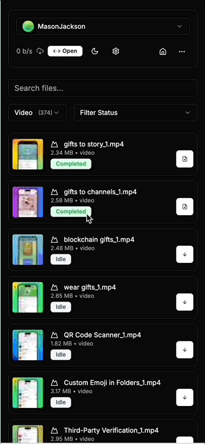

<p align="center">
  
</p>
<p align="center"><h1 align="center">Telegram Files</h1></p>
<p align="center">
  <strong>自托管的 Telegram 文件下载器</strong>
</p>
<p align="center">
  🇨🇳 中文界面 | 📁 优化分组 | 🐳 多平台镜像
</p>
<p align="center">
  <a href="https://github.com/rboyy/telegram-files/blob/main/LICENSE">
    
  </a>
  <a href="https://github.com/rboyy/telegram-files/commits">
    
  </a>
  <a href="https://github.com/rboyy/telegram-files/stargazers">
    
  </a>
</p>

---

## ✨ 优化特性

本版本基于原版 telegram-files 进行了以下优化：

- **中文界面** - 完整的简体中文翻译，所有按钮、提示、错误消息都已汉化
- **优化分组** - GROUP_BY_CHAT 策略使用频道/群组名称代替数字 ID，更直观的文件夹结构
- **多平台支持** - 提供 linux/amd64 和 linux/arm64 镜像，适用于各种服务器环境
- **文件路径优化** - 自动清理文件名中的非法字符，避免创建失败

---

## 🚀 快速开始

### 前置要求

首先需要申请 Telegram API ID 和 Hash，访问 [Telegram API](https://my.telegram.org/apps) 申请。

### 使用 Docker

```bash
docker run -d \
  --name telegram-files \
  --restart always \
  -e TELEGRAM_API_ID=你的API_ID \
  -e TELEGRAM_API_HASH=你的API_HASH \
  -p 6543:80 \
  -v ./data:/app/data \
  rboyy/telegram-files:latest
```

### 使用 docker-compose

复制 `docker-compose.yaml` 和 `.env.example` 到你的目录，编辑 `.env` 填写 API 配置，然后运行：

```bash
docker-compose up -d
```

访问 http://localhost:6543 即可使用！

---

## 📝 功能介绍

- ✅ 从 Telegram 频道和群组下载文件
- ✅ 支持多个 Telegram 账户同时管理
- ✅ 随时暂停和恢复下载
- ✅ 自动转移文件到指定目录（支持按频道名称分组）
- ✅ 即时预览下载的视频和图片
- ✅ 完全响应式设计，支持移动端
- ✅ PWA 支持和离线功能
- ✅ 从 Telegram 分享链接获取文件

---

## 🧩 截图

<div align="center">
  
  
</div>

---

## ⚠️ 重要提示

**请不要将服务暴露到公共互联网！** 该服务不是为公共访问设计的。

---

## 📌 相关链接

- 原版项目：[jarvis2f/telegram-files](https://github.com/jarvis2f/telegram-files)
- 此优化版：[rboyy/telegram-files](https://github.com/rboyy/telegram-files)

---

## 📄 许可证

MIT License - 详见 [LICENSE](LICENSE) 文件。

---

<p align="center">
  Made with ❤️ by <a href="https://github.com/rboyy">RBoy</a>
</p>
